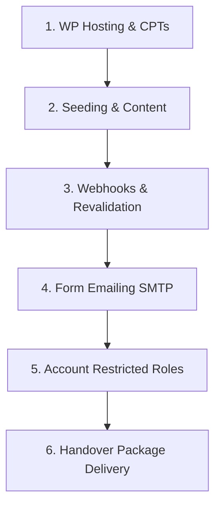

# GBD Doner — Developer Handover Checklist

This document details the step-by-step procedure to professionally deploy, configure, and hand over the headless WordPress + Next.js website to the client.

---

## 📅 Pre-Handover Timeline


---

## 🛠️ Step-by-Step Handover Checklist

### 1. WordPress Server & Plugins Setup
*   **Host WordPress**: Set up a clean WordPress install on a subdomain (e.g., `cms.gbdoner.com` or `api.gbdoner.com`).
*   **Install WPGraphQL**: Go to **Plugins ➔ Add New** on WordPress, install **WPGraphQL** and activate it.
*   **Upload Custom Post Types & Schemas**:
    Upload the files from your local `wordpress` folder into `/wp-content/mu-plugins/` on the server:
    *   `gbd-content-types.php` (Registers Menu Items & Locations)
    *   `gbd-schema.php` (Registers Carbon Fields for CPTs)
    *   `gbd-settings.php` (Registers the Site Settings page)
*   **Install Carbon Fields Source**:
    *   SSH into your server (or use Local Shell/Composer) and run:
        ```bash
        cd wp-content/mu-plugins
        mkdir carbon-fields && cd carbon-fields
        composer require htmlburger/carbon-fields
        ```
    *   *Alternative*: Download the source zip file, upload it to `mu-plugins/carbon-fields`, and run `composer install`.
*   **Flush Permalinks**: Go to **Settings ➔ Permalinks** and click **Save Changes** once. This updates the URL routing for the new content types.

---

### 2. Database Seeding (Pre-populating Content)
Ensure the client doesn't log into an empty dashboard. 
*   **Activate Seeder**: Upload `gbd-seeder.php` to `/wp-content/mu-plugins/gbd-seeder.php`.
*   **Run Seeder**: Go to **Tools ➔ GBD Seeder** in the WordPress admin panel. Click **"Import all mock content into WordPress"**.
*   **Clean Up**: To keep the dashboard clean and prevent the client from re-running the seeder, delete the `gbd-seeder.php` file from the `/wp-content/mu-plugins/` directory once seeding is complete.

---

### 3. Webhooks & Instant Revalidation
Make sure content updates on the live website immediately when the client hits "Update" in WordPress.
*   **Upload `gbd-revalidate.php`**: Copy the revalidation hook (found in `wordpress/README.md` step 7) into `/wp-content/mu-plugins/gbd-revalidate.php`.
*   **Upload `gbd-preview.php`**: Copy the preview hook (found in `wordpress/README.md` step 8) into `/wp-content/mu-plugins/gbd-preview.php`.
*   **Add Keys to WP Configuration**: In `wp-config.php`, add your environment secrets:
    ```php
    putenv('GBD_REVALIDATE_SECRET=your-secure-random-revalidate-token');
    putenv('GBD_PREVIEW_SECRET=your-secure-random-preview-token');
    putenv('GBD_FRONTEND_URL=https://gbdoner.com'); // Your live Next.js URL
    ```

---

### 4. Next.js Production Environment variables
On your hosting provider (Vercel, Netlify, etc.), configure the environment variables under **Project Settings ➔ Environment Variables**:

| Variable Key | Value | Description |
|---|---|---|
| `NEXT_PUBLIC_WORDPRESS_GRAPHQL_URL` | `https://api.gbdoner.com/graphql` | Points to live WordPress endpoint |
| `NEXT_PUBLIC_USE_MOCK_DATA` | `false` | Disables mock data, reads WP |
| `WORDPRESS_REVALIDATE_SECRET` | `your-secure-random-revalidate-token` | Must match GBD_REVALIDATE_SECRET in WP |
| `WORDPRESS_PREVIEW_SECRET` | `your-secure-random-preview-token` | Must match GBD_PREVIEW_SECRET in WP |
| `NEXT_PUBLIC_MAPBOX_TOKEN` | `pk.eyJ...` | Client's production Mapbox key |
| `SMTP_HOST` | `smtp.sendgrid.net` (example) | Outgoing email server |
| `SMTP_PORT` | `587` | Port for SMTP |
| `SMTP_USER` | `apikey` (example) | Username |
| `SMTP_PASS` | `SG.your-key-here` | SMTP password/key |
| `SMTP_FROM` | `noreply@gbdoner.com` | Verified sending domain |

---

### 5. Account Setup & Client Permissions
*   **Create Developer Admin Account**: Keep one full Administrator account for yourself (use a strong password).
*   **Create Client Account**: Go to **Users ➔ Add New**.
    *   Set the role to **Editor**.
    *   This limits their dashboard to content changes only, hiding the code plugins/themes.
    *   They will see *Menu Items*, *Locations*, *Posts*, and *Site Settings* clearly.

---

### 6. Handover Package Delivery
When you deliver the project, send the client a clean handover package containing:
1.  **Welcome Message**: Thank them and outline the deliverables.
2.  **Access Details** (Deliver securely via a shared vault like 1Password or Bitwarden — **never** in raw email text):
    *   WordPress Admin URL (e.g., `https://api.gbdoner.com/wp-admin`)
    *   Client Editor username & password.
    *   Domain control panel details (if you managed it for them).
3.  **Documentation**:
    *   Send them the [CLIENT_USER_GUIDE.md](file:///c:/Users/NUHAYD/gbd-doner-web/wordpress/CLIENT_USER_GUIDE.md).
4.  **Quick Video Walkthrough (Recommended)**:
    *   Record a 5-minute screen recording (Loom or similar) showing:
        1. How to log in.
        2. Editing a price of a menu item and saving it.
        3. Editing a text line on the Home Page and saving it.
        4. Opening the live website to show that the edits went live instantly.
